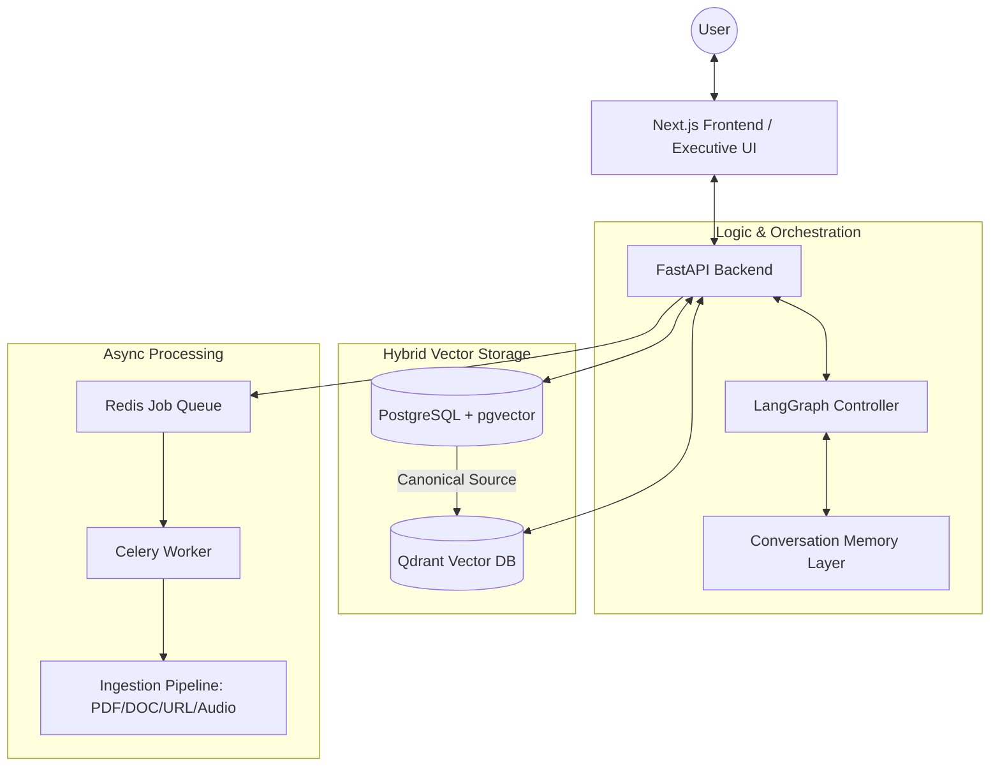

# 🧠 KnowBase — Personal Knowledge Base with AI

[](#)
[](#)

**KnowBase** is a professional-grade "second brain" platform designed for high-performance knowledge management. It enables users to store, organize, and query their private documentation through a sophisticated Hybrid RAG ecosystem.

---

## 🏗 Executive Architecture

KnowBase utilizes a multi-layered storage and retrieval strategy to ensure maximum precision and scalability.



### Key Technical Pillars:
- **Hybrid Retrieval**: Simultaneous dense and sparse search merging results from pgvector and Qdrant using RRF (Reciprocal Rank Fusion).
- **Security Trimming**: End-to-end user-scoped retrieval filters ensuring zero data leakage.
- **Conversational Memory**: Dual-layer memory (Short-term context + Long-term semantic facts) managed via LangGraph namespaces.
- **Traceability**: Real-time relevance scoring and engine attribution for every cited response.

---

## 💎 Core Features

- **Executive 3-Panel Interface**: Sidebar navigation, high-density chat area, and an interactive traceability panel.
- **Universal Ingest**: Native support for PDF, DOCX, Markdown, Text, and Web URLs.
- **Cited Intelligence**: AI responses include interactive markers linked directly to source fragments.
- **Versioning & Audit**: Full history of document versions and status management (Active, Archive, Trash).
- **Admin Observability**: Comprehensive dashboard for prompt management, ingestion job monitoring, and memory rule tuning.

---

## 🚀 Getting Started

### Prerequisites
- Docker & Docker Compose
- OpenAI API Key (or local LLM provider)

### Setup
1. Clone the repository.
2. Create a `.env` file based on `.env.example`.
3. Launch the stack:
   ```bash
   docker compose up -d
   ```
4. Access the platform:
   - **Frontend**: http://localhost:3000
   - **API Docs**: http://localhost:8000/docs

---

## 🛠 Tech Stack

- **Frontend**: Next.js 14 (App Router), TypeScript, Tailwind CSS, shadcn/ui.
- **Backend**: FastAPI (Python 3.12), SQLAlchemy (Async), Celery.
- **Intelligence**: LangGraph, LangChain, OpenAI GPT-4o / whisper-1.
- **Storage**: PostgreSQL (pgvector), Qdrant, Redis.

---

## 🔒 Security & Compliance
- **JWT Authentication**: Secure session management with refresh tokens.
- **Owner Isolation**: Strict database-level isolation of all document chunks and memories.
- **Audit Logs**: Traceability of all destructive actions and sensitive queries.

---
Produced for the **KnowBase-AI Certification Phase**.
*Status: Ready for Production Handover.*
