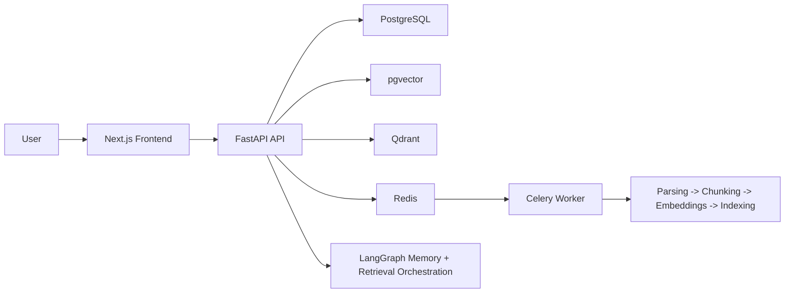
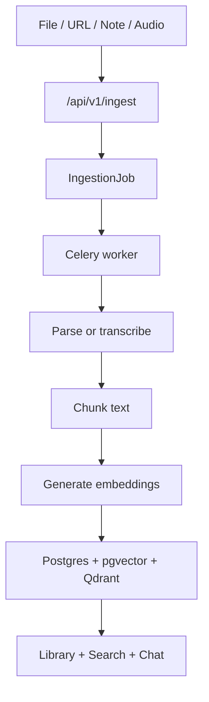
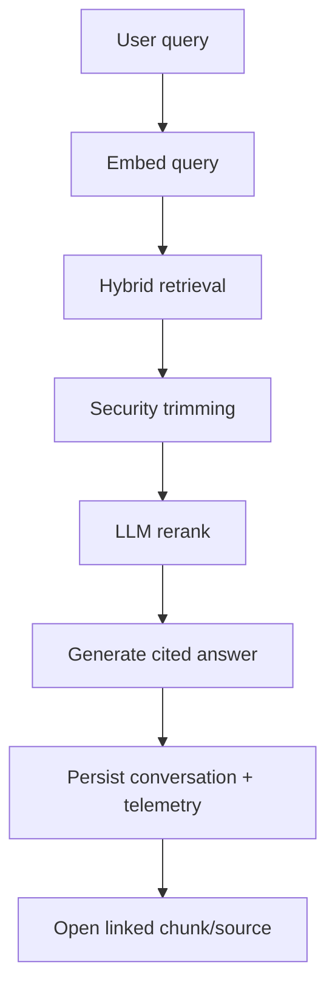

# KnowBase AI

KnowBase is a personal knowledge base with AI chat, hybrid retrieval, persistent memory and source-linked citations. The repository is structured as a Next.js frontend plus a FastAPI backend with PostgreSQL, pgvector, Qdrant, Redis and Celery.

## Product Scope

- Upload PDF, DOCX, TXT, Markdown, images and audio.
- Save direct notes and web links.
- Search with collection, date and tag filters.
- Chat over your own corpus with citations by chunk.
- Jump from a citation to the exact document chunk.
- Persist conversations, feedback and editable memory entries.
- Monitor ingestion jobs and retrieval health from the admin area.

## Architecture



## Main Flows

### Ingestion



### Chat and Retrieval



## Stack

- Frontend: Next.js, TypeScript, Tailwind CSS
- Backend: FastAPI, SQLAlchemy Async
- Orchestration: LangGraph
- Canonical DB: PostgreSQL
- Vector layer: pgvector + Qdrant
- Async jobs: Celery + Redis
- Infra: Docker Compose

## Repository Layout

- `frontend/`: Next.js application.
- `backend/`: FastAPI API, retrieval, ingestion and worker code.
- `scripts/`: workspace quality gate scripts.
- `.github/workflows/quality-gate.yml`: CI workflow.
- `00-ARQUITECTURA-PROYECTO.md`: technical architecture decision record.
- `02-ARQUITECTURA-SITIO.md`: page and component map.
- `MATRIZ-BACKEND.md`: integration matrix.

## Environment Variables

Copy `.env.example` to `.env` and set at least:

- `DATABASE_URL`
- `REDIS_URL`
- `QDRANT_URL`
- `QDRANT_API_KEY`
- `SECRET_KEY`
- `OPENAI_API_KEY`
- `LLM_PRIMARY_MODEL`
- `LLM_ROUTING_MODEL`
- `EMBEDDING_MODEL`
- `RETRIEVAL_BACKEND`
- `NEXT_PUBLIC_API_URL`

## Local Setup

### Prerequisites

- Python 3.12
- Node.js 20+
- Docker and Docker Compose

### Start with Docker

```bash
docker compose up -d --build
```

Services:

- Frontend: `http://localhost:3000`
- Backend docs: `http://localhost:8000/docs`
- Qdrant: `http://localhost:6333`

### Frontend only

```bash
cd frontend
npm install
npm run dev
```

### Backend only

```bash
cd backend
pip install -e .
uvicorn app.main:app --reload
```

## Quality Gate

Workspace scripts:

```bash
npm run check
npm run test
npm run test:smoke
```

What they do:

- `check`: backend compile check and frontend lint when dependencies are installed.
- `test`: verifies required project files exist and are readable.
- `test:smoke`: validates core product markers such as note ingestion, chunk navigation and filtered search support.

## Mandatory Functional Pass

This repository requires a real functional pass for any runtime-impacting change. The rule is enforced at repository level in [AGENTS.md](./AGENTS.md).

The functional pass is required for changes affecting:

- auth
- ingestion
- library
- search or retrieval
- chat
- memory
- admin
- Docker or env wiring
- frontend interaction flows

Minimum evidence expected before closing work:

1. services healthy
2. affected flow exercised in browser
3. backend request verified
4. resulting state visible in UI
5. blocking issue identified from logs if the flow fails

Example closure evidence:

- `GET /health -> 200`
- `POST /api/v1/ingest/note -> 202`
- ingestion job reaches `completed`
- document appears in library
- chat answers with a visible citation and linked source

## Current Evidence

- `frontend/app/(app)/chat/page.tsx`: chat UI with citations and source navigation.
- `frontend/app/(app)/library/[documentId]/page.tsx`: document view with linked chunk focus.
- `backend/app/api/routers/ingest.py`: file, URL and note ingestion entrypoints.
- `backend/app/api/routers/search.py`: hybrid search with collection, date and tag filters.
- `backend/app/api/routers/chat.py`: persistent streaming chat with feedback and telemetry.
- `backend/app/api/routers/admin.py`: job status and retrieval config.

## Screenshots

Real screenshots still need to be captured from a running local build and attached to this README. The code paths and pages above are the current implementation targets for those captures.
